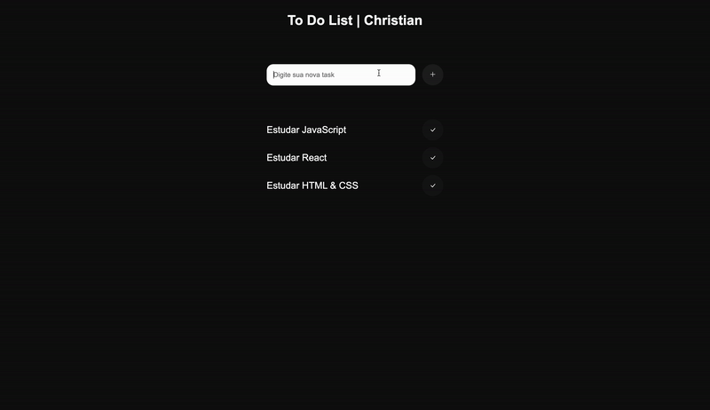

<h1 align="center">To Do List</h1>
<h3 align="center">Lista de tarefas, com a funcionalidade de adicionar novas tarefas e marcar como concluidas, com janela de erro caso escreva a mesma tarefa e caso tente adicionar uma tarefa sem escrever nada no campo de texto </h3>

<h2 align="center">Tecnologias utilizadas</h2>

 
 

 
  
   
   
   

